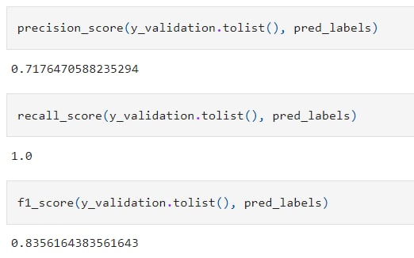
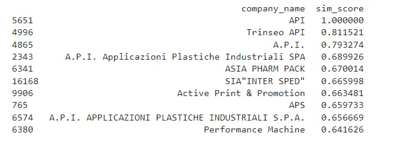
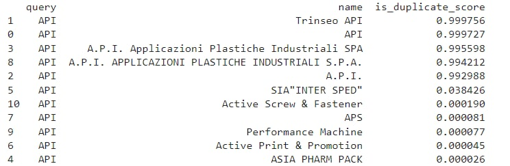

<h1>Company duplicates detection</h1>

Bert only, full dataset

Cosine sentence similarity model

<h4>Cosine sentence similarity model + BERT full dataset

<h3> Metrics </h3>
<ul> <b> Cosine sentence similarity model + BERT full dataset </b>
  <li>Recall: 0.99</li>
  <li>Precicison: 0.89</li>
  <li>F1: 0.96</li>
</ul>

<h3> Сharacteristic </h3>
    <li>GPU 1GB+</li>
  <li>First iteration of database ± 50 comps/sec</li>
  <li>1 query: 6.54 sec </li>
<h3> Models </h3>
Models stored in https://drive.google.com/drive/folders/1mRV56wwNSQTdkFlSU-Wd8Jt920c7uhh9?usp=share_link
<h3> For use </h3> 
Download main notebook (Cos_filter...) and use model from Google Colab
